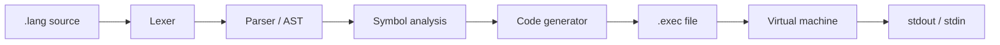

# Course Compiler & Virtual Machine

A small compiler and stack-based virtual machine for a custom imperative language (`.lang` files). The toolchain parses source code, generates bytecode, writes a binary `.exec` file, and runs it on an embedded VM with support for functions, control flow, and **global**, **static**, and **local** variables.

## Features

- Lexer and recursive-descent parser
- Symbol table with scoped variables (global / static / local / parameters)
- Code generator targeting a custom 32-bit instruction set
- Binary executable format (`.exec`) with code, data, and symbol sections
- Virtual machine with stack frames, calls, and returns
- Built-in `print` and `input`
- Example programs in `examples/`

## Requirements

- **Windows** with one of:
  - **Visual Studio 2022** (Desktop development with C++), or
  - **CMake 3.16+** and a C++17 compiler (MSVC recommended)
- C++17

> The provided `build.bat` assumes Visual Studio 2022 Community at the default install path. Adjust the path inside `build.bat` if your installation differs.

## Quick start

### Option A — `build.bat` (MSVC)

```bat
build.bat
build\compiler.exe compile examples\simple.lang -o build\simple.exec
build\compiler.exe run build\simple.exec
```

Expected output for `simple.lang`:

```text
17
```

### Option B — CMake

```bat
cmake -B build -G "Visual Studio 17 2022"
cmake --build build --config Release
build\Release\course_compiler.exe compile examples\simple.lang -o build\simple.exec
build\Release\course_compiler.exe run build\simple.exec
```

## Command-line usage

```text
course_compiler compile <source.lang> -o <out.exec> [--dump]
course_compiler run <out.exec> [--trace]
```

With `build.bat`, the executable is `build\compiler.exe` (same commands, different path).

| Command | Description |
|---------|-------------|
| `compile` | Parse and compile a `.lang` file into a `.exec` binary |
| `-o <file>` | Output path for the compiled program |
| `--dump` | (optional) Print generated instruction words in hex |
| `run` | Load and execute a `.exec` file |
| `--trace` | (optional) Reserved for VM tracing |

Every program **must** define `func main()` as the entry point.

## Running all examples

```bat
build.bat

build\compiler.exe compile examples\simple.lang         -o build\simple.exec
build\compiler.exe compile examples\local_test.lang       -o build\local_test.exec
build\compiler.exe compile examples\call_test.lang        -o build\call_test.exec
build\compiler.exe compile examples\while_test.lang       -o build\while_test.exec
build\compiler.exe compile examples\functions_for.lang    -o build\functions_for.exec
build\compiler.exe compile examples\globals_static.lang   -o build\globals_static.exec

build\compiler.exe run build\simple.exec
build\compiler.exe run build\local_test.exec
build\compiler.exe run build\call_test.exec
build\compiler.exe run build\while_test.exec
build\compiler.exe run build\functions_for.exec
build\compiler.exe run build\globals_static.exec
```

| Example | Expected output |
|---------|-----------------|
| `simple.lang` | `17` |
| `local_test.lang` | `2` |
| `call_test.lang` | `3` |
| `while_test.lang` | `0` then `1` |
| `functions_for.lang` | `14` |
| `globals_static.lang` | `6`, `3`, `3` |

## Language syntax

### General rules

- Statements end with a **colon** `:` (not a semicolon).
- Blocks use curly braces `{` `}`.
- Line comments start with `//` and run to the end of the line.
- Identifiers: letters, digits, underscore; must not start with a digit.
- Integer literals: non-negative decimal integers (e.g. `0`, `42`).

### Program structure

At **top level** you may declare:

- `global` variables
- `static` variables (file scope)
- `func` definitions

Inside functions you use statements, local/static declarations, and control flow.

```lang
global counter = 0:
static total = 0:

func helper(x) {
    return x + 1:
}

func main() {
    local n = 10:
    print(helper(n)):
}
```

### Variables

| Keyword | Scope | Lifetime | Where allowed |
|---------|--------|----------|----------------|
| `global` | Whole program | Entire run | Top level or inside functions |
| `static` | Function or file | Persists across calls | Top level (`static x = 0:`) or inside a function |
| `local` | Current function | Stack frame | Inside functions only |

**Declaration syntax:**

```lang
global g = 0:
static s = 10:

func main() {
    local x = 1:
    static calls = 0:
    g = 5:
    x = x + 1:
}
```

- Initialization uses `=` and an **expression** (often a constant).
- Locals live on the stack; globals and statics live in the **data section** of the `.exec` file.
- Function-static names are mangled per function (e.g. `main::calls`).

### Functions

```lang
func name(param1, param2) {
    local a = 0:
    return param1 + param2:
}
```

- Parameters are passed in registers; the **return value** is placed in register `R1` (visible to the caller after `return`).
- `main()` is required; the runtime calls it at startup.
- Function calls may be used as statements or inside expressions:

```lang
print(add(1, 2)):
local x = square(3):
```

### Statements

| Statement | Syntax |
|-----------|--------|
| Variable declaration | `local x = expr:` / `global g = expr:` / `static s = expr:` |
| Assignment | `name = expr:` |
| Print | `print(expr):` |
| Input | `input(name):` — reads one integer from stdin into variable `name` |
| Return | `return expr:` |
| Expression call | `foo(a, b):` |
| If | `if (condition) { ... }` optional `else { ... }` |
| While | `while (condition) { ... }` |
| Do-while | `do { ... } while (condition):` |
| For | `for (init : condition : update) { ... }` |

**For-loop** parts:

- **init** — optional variable declaration (`local i = 0:`) or assignment (`i = 0:`), or empty
- **condition** — comparison expression (see below)
- **update** — must be an assignment (e.g. `i = i + 1:`)

```lang
for (local i = 0 : i < 4 : i = i + 1) {
    print(i):
}
```

### Expressions

- Literals: `42`
- Variables: `x`
- Binary operators: `+`, `-`, `*`, `/` (integer division; divide by zero yields `0`)
- Parentheses: `(a + b) * c`
- Function calls: `foo(a, b, c)`
- Comparisons (`==`, `!=`, `<`, `>`, `<=`, `>=`) are allowed in **conditions** (if / while / for), not as general expression values

**Operator precedence** (highest to lowest):

1. `*`, `/`, `%` (modulo is recognized by the lexer but not fully implemented in codegen)
2. `+`, `-`
3. Comparisons (only in condition contexts)

### Conditions

Used in `if`, `while`, `do while`, and `for`:

```lang
if (x < 10) {
    print(x):
} else {
    print(0):
}

while (i != 5) {
    i = i + 1:
}
```

Non-comparison expressions in `if (expr)` are treated as “not equal to zero”.

### Keywords

```
func  if  else  for  while  do  return
print  input
global  local  static
```

> `elif` is not implemented in the parser (only reserved in the lexer).

## Project structure

```text
course project/
├── src/
│   ├── main.cpp          # CLI: compile / run
│   ├── lexer.cpp/h       # Tokenization
│   ├── parser.cpp/h      # AST construction
│   ├── ast.h             # AST node types
│   ├── token.h           # Token types
│   ├── symbols.cpp/h     # Symbol table, scopes
│   ├── codegen.cpp/h     # Bytecode generation
│   ├── isa.h               # Instruction encoding
│   ├── exec_format.cpp/h # .exec read/write
│   └── vm.cpp/h          # Virtual machine
├── examples/             # Sample .lang programs
├── build.bat             # MSVC build script
├── CMakeLists.txt        # CMake build
└── README.md
```

## How it works (overview)



1. **Compile** — Source is tokenized, parsed into an AST, analyzed for symbols, then lowered to 32-bit instruction words plus a data segment for globals/statics.
2. **Run** — The VM loads code and data into memory, sets up a stack, calls `main`, and executes instructions until `EXIT`.

Calling convention (simplified):

- Caller saves frame with `PUSH_BP` and `PUSH_NEXT_PC`, then `CALL`.
- Callee allocates locals with `ALLOC_STACK`, returns with `RET`.
- Function result is in register `R1`.


